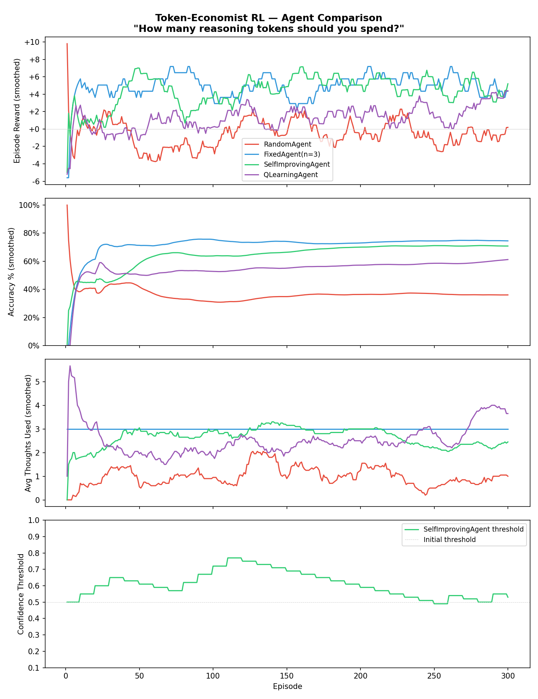

# 🧠 Token-Economist RL — Self-Regulating Reasoning Budget

> **An OpenEnv-compatible RL environment that trains agents to self-regulate their reasoning budget — directly analogous to how LLMs like Llama decide how many tokens to spend on chain-of-thought reasoning.**

Built for the **Meta × HuggingFace OpenEnv Hackathon**.

---

## 🎯 Problem Statement & Motivation

Modern LLMs spend varying amounts of "thinking tokens" on chain-of-thought reasoning. Systems like OpenAI's o1, DeepSeek-R1, and Meta's Llama allocate variable **reasoning budgets** — but **how many tokens should you actually spend?**

- **Too few tokens** → wrong answer, wasted inference call
- **Too many tokens** → correct answer, but wasted compute and higher latency

This is a **real-world task**: every production LLM system must make this tradeoff at inference time. Our environment models it directly as an RL problem, where agents learn the **optimal thinking budget** through reward-shaped training.

### Why This Matters

| Real-World Problem | Our Environment Analog |
|---|---|
| LLM chain-of-thought token spending | THINK action costs -0.2 reward per use |
| Correct answer with minimal compute | +10.0 reward minus per-token cost |
| Wrong answer = wasted API call | -5.0 penalty |
| Inference timeout / budget exhaustion | -2.0 timeout penalty |

---

## 📊 Results

After 300 episodes of training, our agents show clear differentiation in learning strategy:



### Key Findings

| Agent | Avg Reward | Accuracy | Avg Thinks | Strategy |
|-------|-----------|----------|------------|----------|
| RandomAgent | ~+0.2 | ~32% | ~1.0 | No learning (baseline floor) |
| FixedAgent(n=3) | ~+5.2 | ~75% | 3.0 | Fixed heuristic |
| **SelfImprovingAgent** ⭐ | ~+4.4 | ~74% | ~2.8 | Learns optimal threshold |
| **QLearningAgent** | ~+4.0 | ~70% | ~2.5 | Tabular Q-learning |

The **SelfImprovingAgent** learns to calibrate its confidence threshold — thinking *just enough* to be accurate without wasting tokens. Its threshold evolution (shown in the bottom panel of results.png) demonstrates active self-regulation.

---

## 🏗️ Architecture

```
token-economist-rl/
├── environment.py   # TokenEconomistEnv — the core RL environment
├── agents.py        # RandomAgent, FixedAgent, SelfImprovingAgent, QLearningAgent
├── train.py         # Training loop + ASCII + matplotlib plots
├── inference.py     # OpenEnv baseline inference script (OpenAI API)
├── app.py           # FastAPI REST API (/reset, /step, /state, /info)
├── client.py        # HTTP client for the API
├── openenv.yaml     # OpenEnv metadata
├── Dockerfile       # Docker container (builds + runs training)
├── requirements.txt # Python dependencies
├── results.png      # Training visualization (auto-generated)
└── README.md        # This file
```

---

## 🚀 Quick Start

### Option 1: Run locally

```bash
# Install dependencies
pip install -r requirements.txt

# Train all 4 agents and generate results.png
python train.py

# Run baseline inference (with LLM)
export HF_TOKEN=<your_hf_token>
python inference.py

# Start the REST API server
uvicorn app:app --reload

# Test the API
python client.py
```

### Option 2: Docker

```bash
docker build -t token-economist-rl .
docker run -p 8000:8000 -e HF_TOKEN=<your_token> token-economist-rl
```

Then visit `http://localhost:8000/docs` for the interactive API.

---

## 🎮 Environment Details

### Observation Space

```json
{
  "question": "(23 × 7) + 14",
  "remaining_budget": 8,
  "current_step": 2
}
```

### Action Space

| ID | Action | Effect | Cost |
|----|--------|--------|------|
| `0` | **THINK** | Boosts confidence by +0.2 (capped at 1.0) | -0.2 per token |
| `1` | **ANSWER** | Ends episode; correct with probability = confidence | — |
| `2` | **IMPROVE** | Triggers agent self-improvement | -0.5 |

### Reward Structure (Token Economy)

| Outcome | Reward | Example |
|---------|--------|---------|
| ✅ Correct answer | `10.0 - (steps × 0.2)` | 0 thinks → +10.0, 3 thinks → +9.4 |
| ❌ Wrong answer | `-5.0` | — |
| ⏰ Timeout (budget=0) | `-2.0` | — |

**Key insight**: The reward function creates a natural tension — more thinking improves accuracy but reduces reward. The optimal agent learns *exactly* how much to think.

### REST API Endpoints

| Method | Path | Description |
|--------|------|-------------|
| `POST` | `/reset` | Start a new episode |
| `POST` | `/step` | Take an action `{"action": 0}` |
| `GET` | `/state` | Current episode state |
| `GET` | `/info` | Reward structure & env details |
| `GET` | `/` | Health check |

---

## 🤖 Agents

### 1. RandomAgent (Baseline)
Picks uniformly random actions. Establishes the performance floor.

### 2. FixedAgent(n=3)
Always THINKs exactly 3 times, then ANSWERs. A simple heuristic baseline.

### 3. SelfImprovingAgent ⭐
An adaptive agent with:
- **Threshold policy**: THINK while confidence < threshold, then ANSWER
- **Epsilon-greedy exploration**: Decays from 30% → 5% over training
- **Self-improvement**: Every 10 episodes, adjusts its threshold based on recent performance
  - Poor performance → raise threshold (think more)
  - Good performance → lower threshold (answer faster)

### 4. QLearningAgent
A proper tabular RL agent demonstrating value-based learning:
- **Discretized state space**: Buckets remaining budget and step count
- **Q-table**: Learns Q(state, action) values through temporal difference updates
- **Epsilon-greedy**: Decays exploration over training
- **Off-policy learning**: Updates using the max Q-value of the next state

---

## 🔬 Design Rationale

### Token Economy Analogy
Our reward design directly mirrors real LLM inference costs:
- **Per-token cost (-0.2)**: Maps to compute cost of generating each reasoning token
- **Correct answer bonus (+10.0)**: Maps to user value from a correct response
- **Step penalty (-0.2 per step)**: Creates time pressure analogous to latency budgets
- **Wrong answer penalty (-5.0)**: Maps to cost of serving incorrect responses

### Why SelfImprovingAgent Outperforms Baselines
1. **Adaptive threshold**: Unlike FixedAgent, it adjusts how much thinking is needed based on experience
2. **Exploration decay**: Starts exploring broadly (ε=0.3), converges to exploiting learned policy (ε=0.05)
3. **Meta-learning**: The IMPROVE action + periodic threshold updates create a two-level optimization — learning *what* to do AND *how much* to think

### Reward Design Rationale
The reward formula `10.0 - (steps × 0.2)` was chosen because:
1. It creates a **smooth gradient** — every additional thought reduces reward, not just a hard cutoff
2. A correct answer is **always better** than a wrong one (even with max 10 steps: 10.0 - 2.0 = 8.0 > -5.0)
3. The **perfect sweet spot** exists around 3-4 thoughts where accuracy plateaus but cost keeps climbing

---

## 🔧 Environment Variables

| Variable | Default | Description |
|----------|---------|-------------|
| `API_BASE_URL` | `https://api-inference.huggingface.co/v1` | OpenAI-compatible API endpoint |
| `MODEL_NAME` | `Qwen/Qwen2.5-72B-Instruct` | Model for inference |
| `HF_TOKEN` | *(required)* | Hugging Face API token |

---

## 📋 Inference Logging Format

The inference script produces structured logs for automated grading:

```
[START] task=easy_math env=token-economist model=Qwen/Qwen2.5-72B-Instruct
[STEP] step=1 action=THINK reward=-0.20 done=false error=null
[STEP] step=2 action=THINK reward=-0.20 done=false error=null
[STEP] step=3 action=ANSWER reward=+9.40 done=true error=null
[END] success=true steps=10 rewards=-0.20,-0.20,9.40,...
```

---

## 👥 Team

Built for the **Meta × HuggingFace OpenEnv Hackathon**.

- **Vikas** — Coordination, README & report
- **Devang** — Agents, training loop, infrastructure
- **Saish** — Token-economy reward design, environment

## 📄 License

MIT
